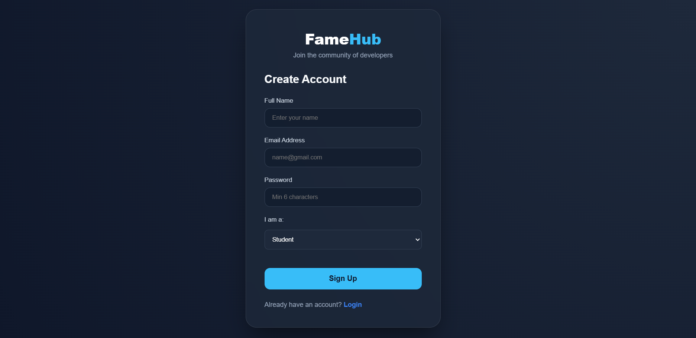
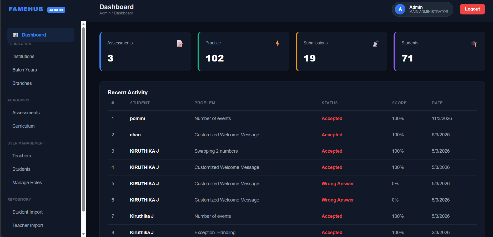
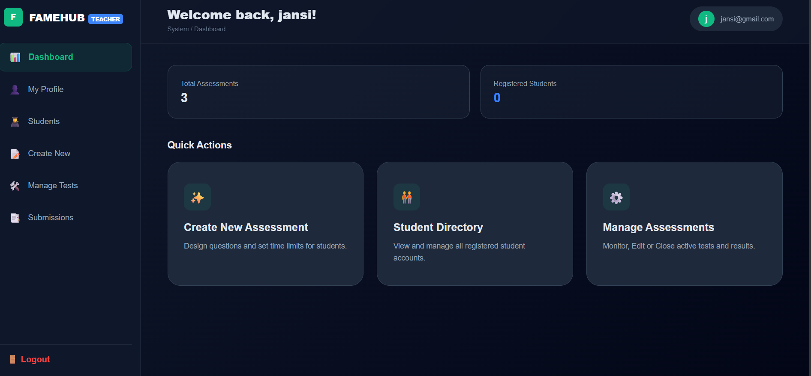
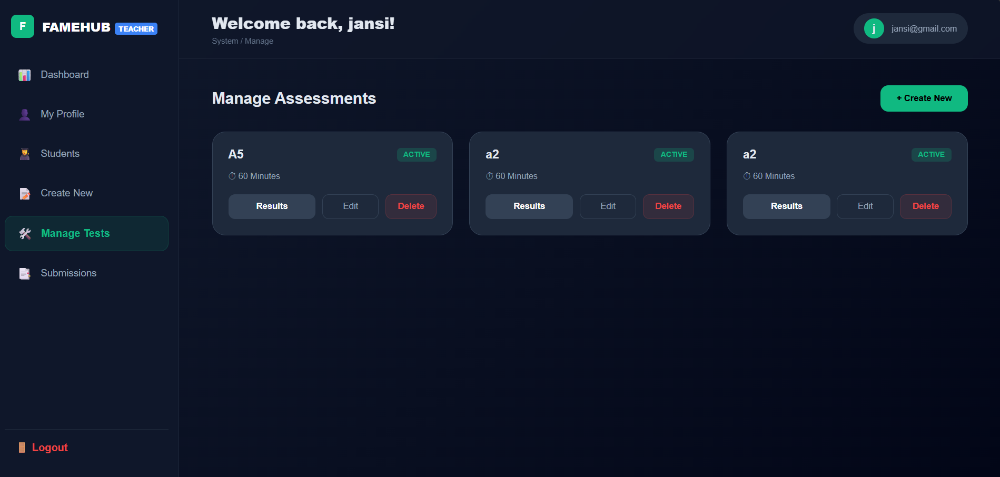
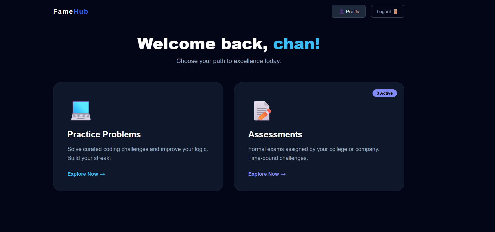
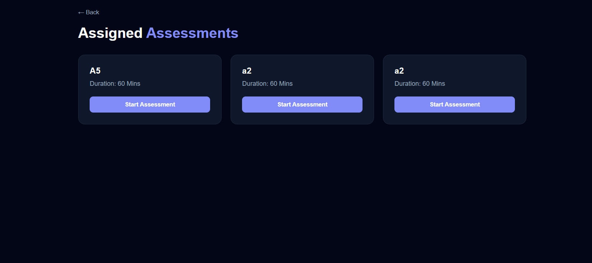
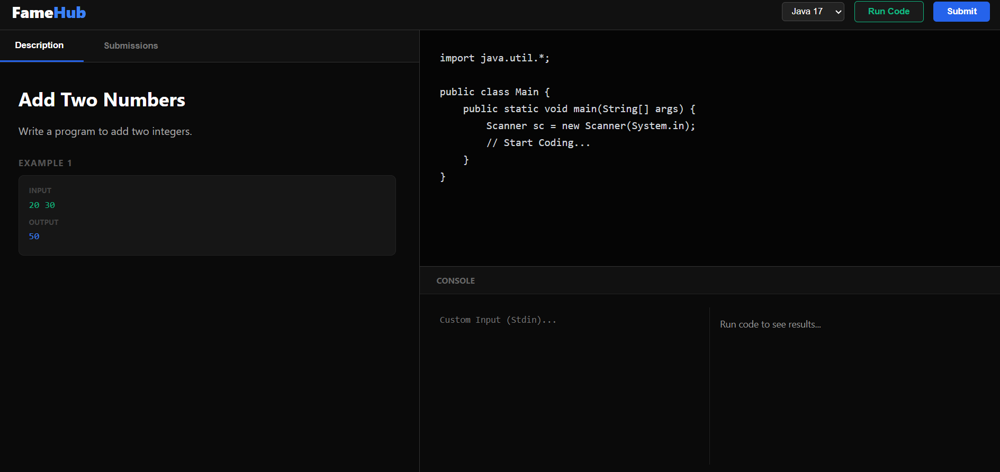

# online-coding-assessment-platform
Full Stack Online Coding Assessment Platform built using React, Spring Boot, JWT Authentication, JPA, PostgreSQL and Monaco Editor.

## Description
This is a Full Stack Web Application developed for conducting online coding  assessments. 
The platform allows admins to create tests and students to attend coding assessments online with automatic code execution.

## Technologies Used
- React JS
- Spring Boot
- REST API
- JWT Authentication
- JPA / Hibernate
- PostgreSQL
- Monaco Editor

## Features
- User Registration & Login
- Role Based Access (Admin / Student)
- Question Bank Management (Coding)
- Assessment Creation
- Online Coding Test
- Code Execution
- Results & Reports

## Project Structure
frontend - React Application  
backend - Spring Boot Application
## Screenshots

### Login Page

### Signup Page

### Admin Dashboard

### Teacher Dashboard

### Manage Test

### Student Dashboard

### Student Assessment

### Code Editor

## Author
Kiruthika
